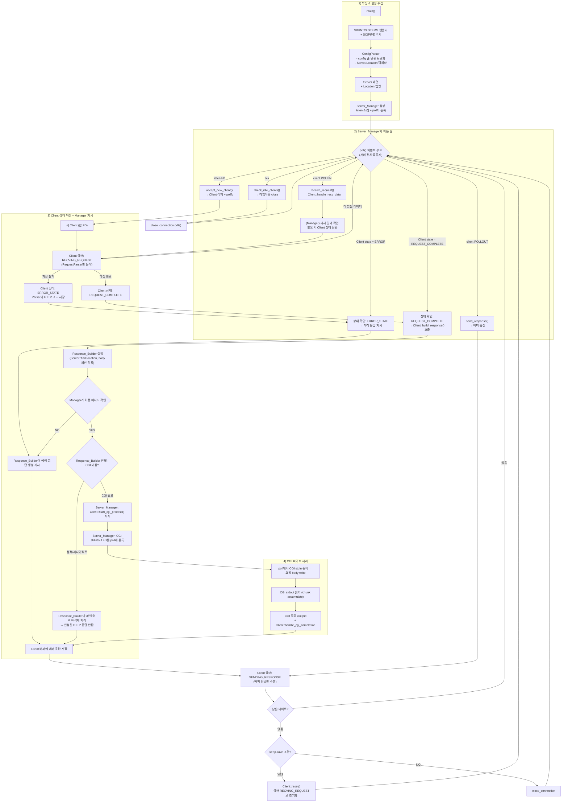

# webserv 전체 구조 한눈에 보기

이 문서는 webserv 서버의 전체 구조를 **한 장의 지도처럼** 보여주는 것을 목표로 한다.  
개별 클래스의 구현 디테일이 아니라,  
**요청 하나가 서버 내부에서 어떻게 흘러가는지**를 제어 흐름 관점에서 정리한다.

---

## 객체별 책임과 역할

### ConfigParser
- 설정 파일을 열고 줄을 모은 뒤 토큰화하여 server 블록 외의 토큰이 등장하면 즉시 에러를 던진다 (`config_parser/config_parser.cpp:97`, `:132`).
- `parseServerBlock`은 `listen`, `server_name`, `root`, `client_max_body_size`, `error_page`, `location` 등을 파싱하며 `listen` 누락 시 예외를 발생시킨다 (`:208`).
- `parseLocationBlock`은 `allowed_methods`, `autoindex`, `upload`, `return`, `cgi`, `client_max_body_size`를 `Location`에 채운다 (`:285`).

### Server
- listen 대상, 서버 이름, 루트, body 제한, Location 배열, 에러 페이지 매핑을 보관하는 **설정 컨테이너** (`Server.hpp:24`).
- `findLocation`은 가장 긴 prefix 매칭 Location을 반환한다 (`Server.cpp:81`).

### Location
- 경로 단위 설정 컨테이너 (`Location.hpp:23`).
- 업로드, body 제한, 리다이렉트, CGI 설정을 명시적으로 보관 (`Location.cpp:59`).

### Server_Manager
- `init_sockets`에서 논블로킹 listen 소켓 생성 후 `_poll_fds`에 등록 (`Server_Manager.cpp:122`).
- `run` 루프에서 `poll()`로 이벤트 분배 (`:568`, `:401`).
- `receive_request`, `send_response`는 Client 객체를 찾아 위임 (`:457`, `:485`).
- CGI는 `register_cgi_fds` / `handle_cgi_poll_event`로 관리 (`:254`).

### Client
- 연결 1개를 대표하는 **상태 머신** (`Client.hpp:31`).
- `handle_recv_data`에서 파싱 진행/완료/에러 판정 (`Client.cpp:628`).
- `build_response`에서 `Response_Builder` 호출 (`:665`).
- CGI는 `start_cgi_process`, `handle_cgi_*`로 관리 (`:287`, `:450`).

### RequestParser
- 요청 라인 → 헤더 → 바디 → 청크 파싱 state machine (`request_parser.cpp:118`).
- 메서드/버전 검증 (`:221`), 헤더/바디 처리 (`:288`, `:430`).
- 청크 파싱 (`:481`, `:531`).
- body 제한 초과 시 413 반환 가능 (`:571`).

### http_request
- HTTP 요청 데이터 컨테이너 (`http_request.cpp:22`).
- path/query 분리, 헤더 소문자 정규화 (`:101`, `:138`).

### Response_Builder / Response_cgi
- `Server::findLocation` 결과 기반으로 응답 결정 (`Response_Builder.cpp:516`).
- GET/POST/DELETE 처리 (`:409`, `:458`, `:310`).
- CGI 여부 판단 및 결과 재조립 (`Response_cgi.cpp:17`, `:46`).
- 에러/리다이렉트 빌더 제공 (`Response_Builder.cpp:175`, `:241`).

### Logger / Error / Utils
- Logger: 컬러 로그 출력 (`Logger.cpp:60`)
- Error: 파일/라인 포함 예외 (`Error.cpp`)
- Utils: 문자열/변환 유틸 (`Utils.cpp`)

---

## 요청 처리 플로우차트 (Mermaid)

